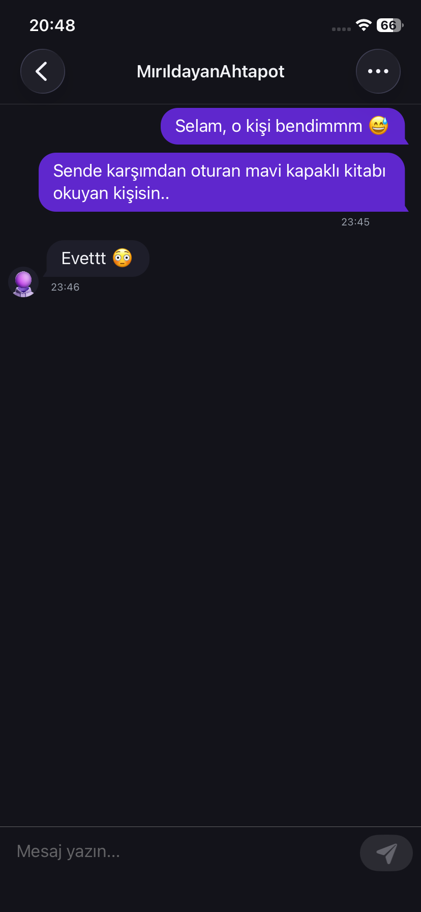

<h1 align="center">
   
  
   
  itirafApp
   
</h1>

<h4 align="center">İnsanların içindekileri anonim ve özgürce dökebildiği, eğlenceli ve güvenli Android itiraf platformu 🎭</h4>

  
  
  
  

  
  &nbsp;
  

  <a href="#-proje-hakkında">Hakkında</a> •
  <a href="#-ekran-görüntüleri">Ekran Görüntüleri</a> •
  <a href="#-i̇ndir">İndir</a> •
  <a href="#-öne-çıkan-özellikler">Özellikler</a> •
  <a href="#-kullanılan-teknolojiler">Teknolojiler</a> •
  <a href="#-geliştirici">Geliştirici</a>

---

## 📖 Proje Hakkında

**itirafApp**, kullanıcıların kimliklerini tamamen gizli tutarak içlerindeki sırları, komik anılarını veya dertlerini paylaşabilecekleri bir anonim sosyal ağ uygulamasıdır.

%100 Kotlin ile geliştirilmiş olup, Jetpack Compose tabanlı modern Android tasarım standartlarına uygun, akıcı ve kullanıcı dostu bir arayüze sahiptir. Kullanıcılar yalnızca kendi seçtikleri anonim kimliklerle etkileşime girer, böylece gerçek dünyadan bağımsız ve özgür bir paylaşım ortamı oluşur.

## 📱 Ekran Görüntüleri

  
  &nbsp;&nbsp;
  
  &nbsp;&nbsp;
  
  &nbsp;&nbsp;
  

## 📥 İndir

  
  &nbsp;
  

## ✨ Öne Çıkan Özellikler

| Özellik | Açıklama |
|---------|----------|
| 🎭 **Anonim Paylaşım** | Kullanıcılar tamamen anonim kalarak itiraflarını özgürce yazabilirler |
| 📬 **Anlık Bildirimler** | Firebase Cloud Messaging ile yeni mesajlar, beğeniler ve güncellemelerden anında haberdar olma |
| 💬 **Gerçek Zamanlı Mesajlaşma** | WebSocket destekli anlık mesaj gönderme ve alma sistemi |
| 📢 **Kanal Sistemi** | Farklı konularda organize edilmiş kanallar aracılığıyla itirafları keşfetme |
| 🔔 **Bildirim Yönetimi** | Özelleştirilebilir bildirim tercihleri ile tam kontrol |
| 🛡️ **Moderasyon** | İçerik güvenliğini sağlamak için gelişmiş raporlama ve moderasyon altyapısı |
| 🎨 **Modern Arayüz** | Jetpack Compose ile oluşturulmuş, göz yormayan ve akıcı UI/UX tasarımı |
| 🚀 **Onboarding** | Yeni kullanıcılar için adım adım tanıtım ekranları |
| 🌗 **Dark / Light Tema** | Kullanıcı tercihine göre karanlık ve aydınlık tema desteği |
| 🌍 **Çoklu Dil Desteği** | Türkçe ve İngilizce dil desteği |
| 🔐 **Google ile Giriş** | Google Credential Manager ile hızlı ve güvenli oturum açma |

## 🛠 Kullanılan Teknolojiler

| Kategori | Teknoloji |
|----------|-----------|
| **Dil** | Kotlin |
| **Arayüz** | Jetpack Compose + Material 3 |
| **Mimari Desen** | MVVM + Clean Architecture |
| **Dependency Injection** | Hilt (Dagger) |
| **Backend İletişimi** | Retrofit + OkHttp |
| **Gerçek Zamanlı İletişim** | WebSocket (OkHttp) |
| **Hata Takibi** | Firebase Crashlytics |
| **Bildirimler** | Firebase Cloud Messaging (FCM) |
| **Kullanıcı Analizi** | Microsoft Clarity |
| **Kimlik Doğrulama** | Google Credential Manager |
| **Navigasyon** | Navigation Compose |
| **Güvenli Depolama** | EncryptedSharedPreferences |
| **Tema** | Dark / Light Mode |
| **Lokalizasyon** | Multi-Language (TR, EN) |

## 📋 Gereksinimler

- Android 8.0 (API 26) ve üzeri
- Android Studio Ladybug veya üzeri
- JDK 17

## 👨‍💻 Geliştirici

- **GitHub:** [@EmreYlr](https://github.com/EmreYlr)
- **LinkedIn:** [Emre Can Yeler](https://www.linkedin.com/in/emrecanyeler/)
